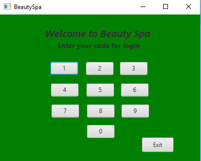
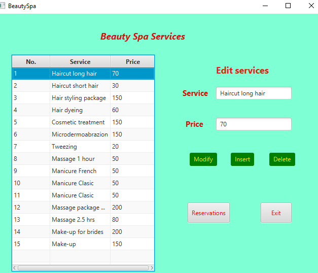
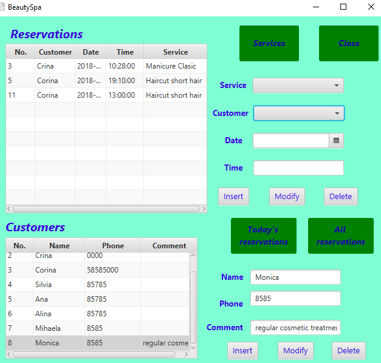

# Beauty-salon-management---Java-FX
This is a beauty salon management software developed using JavaFX programming language, focused on CRUD operations. 
This project is made for a university course.
Database: MySQL
To run it you need to have
•	NetBeans or you need to install JDK on your own
•	MySQL pre-installed
•	some MySQL UI ( I used phpmyadmin )
•	mysql-connector
Code for login: 0000
Screenshots

 
  
    
